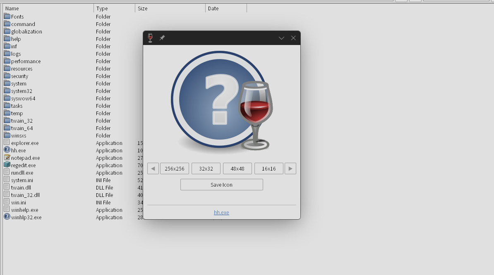
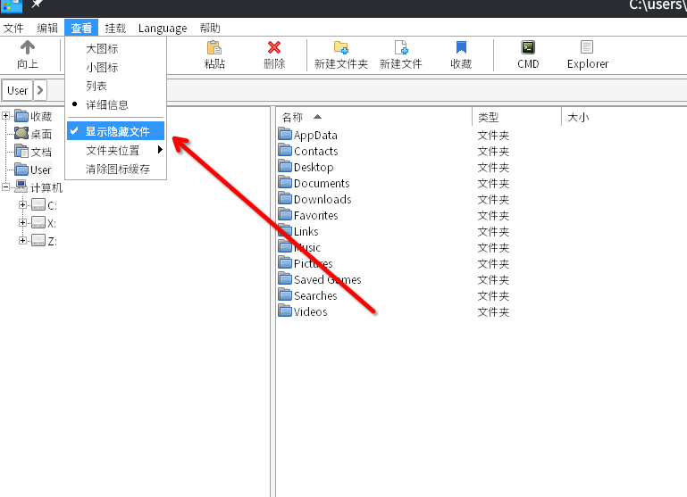

# Winlator File Manager

更快，更方便，支持多语言，强大且简单快速的文件管理器。
运行在Wine / Winlator 上。

通过 AI 完成了百分之99% 的编写工作。

# 截图




# 注册表结构
```
Windows Registry Editor Version 5.00

[HKEY_CURRENT_USER\Software\Winlator\WFM]
"ViewStyle"=dword:00000003

[HKEY_CURRENT_USER\Software\Winlator\WFM\Bookmarks]
"Bookmark0"="Z:\\tmp"

[HKEY_CURRENT_USER\Software\Winlator\WFM\ContextMenu]

[HKEY_CURRENT_USER\Software\Winlator\WFM\ContextMenu\7-Zip]
"Extract Here"="Z:\\\\opt\\\\apps\\\\7-Zip\\\\7zG.exe x \"%FILE%\" -r -o\"%DIR%\" -y"
"Extract to Folder"="Z:\\\\opt\\\\apps\\\\7-Zip\\\\7zG.exe x \"%FILE%\" -r -o\"%DIR%\\\\%BASENAME%\" -y"
"Open Archive"="Z:\\\\opt\\\\apps\\\\7-Zip\\\\7zFM.exe \"%FILE%\""

[HKEY_CURRENT_USER\Software\Winlator\WFM\Language]
"lang"="zh"


```

# 实现的功能（排名不分前后）

1. 右键exe的菜单功能里可以查看更清晰的文件图标
2. 可以收藏路径
3. 可以设置其中一个收藏的路径在启动wfm 立即打开
4. 工具栏实现直接定位到挂载的镜像文件
5. 工具栏实现直接取消挂载的镜像
6. 左侧栏加入了User，可以直接定位到C盘用户目录
7. 高DPI适配，且字体在wine下运行也不会模糊
8. exe图标可以直接获取到软件的图标集合，查看不同尺寸的图标，并且可以保存为ico文件
9. 加入了语言切换功能，设置后不受locale影响
10. 可以查看盘符剩余空间大小
11. 查看视图（大图标，小图标）持久保存在注册表
12. 搜索结果右键指定文件的菜单里可以直接定位到文件所在位置
13. 加入了explorer启动，cmd启动的按钮（请务必在进入有效路径后，这两个按钮才会生效）
14. 使用挂载功能不再需要*libcdio.dll*文件了-> by [nostalgia296](https://github.com/Waim908/wfm/pull/2)
15. 可以查看隐藏文件了
16. 可以设置或选择文件类型的打开程序（不干预系统全局文件类型设置）
17. 文件排序可以在查看中切换为windows资源管理器的同款文件夹在上的排序，如果你习惯dolpin或者explorer的排序可以快速上手

相较于原版wfm

1. 加入了中文支持
2. 文件列出速度更快
3. wfm 启动速度更快
4. 修复了一些bug
5. 除了中文也包含了 葡萄牙语 英语 俄语 的更新与支持。
6. 搜索文件速度更快，且更稳定

# 问题

Q: 没有显示`.XXX`的Linux隐藏文件？

A: 

Q: 文件图标出现了混淆？

A: 点击查看-> 清理图标缓存 即可

Q： 禁用libcdio 挂载功能？

A：在编译时加上 ```make USE_LIBCDIO=0``` 

Q: 需要创建X挂载盘？

A: 

方法1

打开winecfg

切换到驱动器(driver) , 点击添加

选择盘符X

驱动器类型设置为光驱（如果你只是单纯解压镜像文件甚至不需要设置为光驱）

注意路径必须设置为非根目录否则会出问题，尤其对于winlator而言

方法2

执行以下命令
```
# 切换到你的WINEPREFIX 目录，如果没有定义那么就在~/.wine

mkdir drive_x

cd dosdevices

ln -s ../drive_x x:

cd ../drive_x

# 伪造X盘序列号(在winlator中) <--  可选，wine默认就是这个序列号
echo "58000000" > .windows-serial
```

无论X盘在winecfg中的定义是光驱还是自动检测都是可以正常解压文件进去的，你也可以手动在winecfg中定义X盘为光驱类型


Q：如何卸载wfm？

A: 确保你的挂载盘取消挂载后，删除*wfm.exe*和*libcdio.dll*，执行bat脚本*del-reg.bat*或者删除注册表
```HKEY_CURRENT_USER\Software\Winlator\WFM```
更进一步请删除
```HKEY_CURRENT_USER\Software\Winlator```


# 在 Linux 上快速完成编译

1. 安装mingw64

2. ```make -j4``` 如果需要 libcdio 文件挂载功能支持，必须使用```make USE_LIBCDIO=1 -j4``` PS: 数字4 为编译线程数，根据CPU核心数自行设置。

3. 编译完成，执行exe文件

# 感谢以下项目

- [libcdio](https://github.com/libcdio/libcdio)

- [wine](https://github.com/wine-mirror/wine)