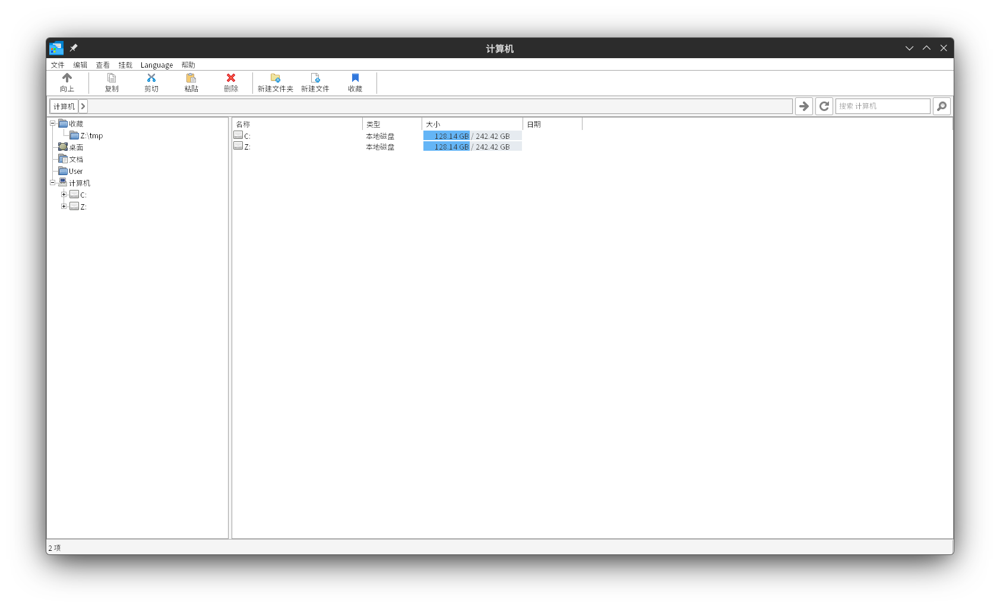
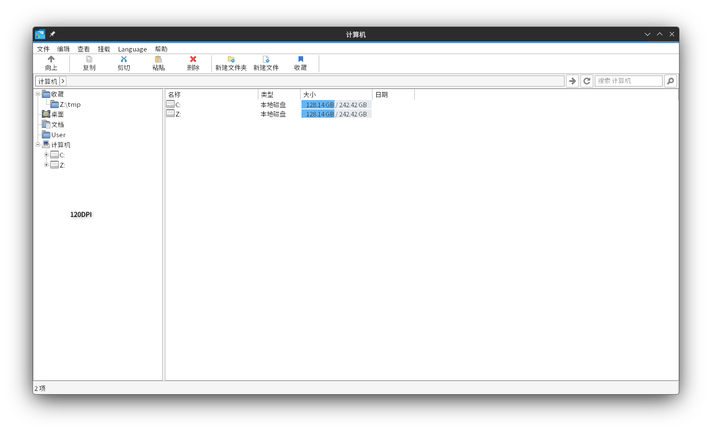
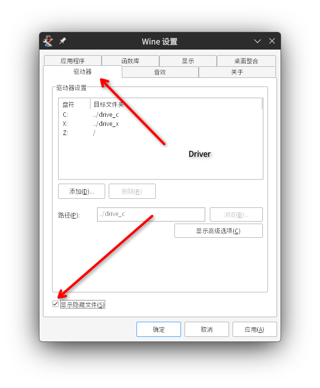
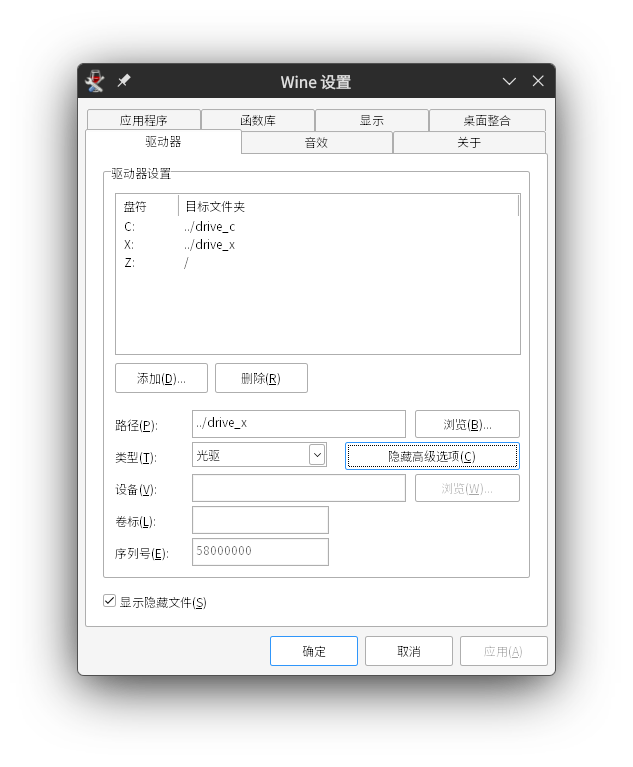

# Winlator File Manager

更快，更方便，支持多语言，强大且简单快速的文件管理器。
运行在Wine / Winlator 上。

通过 AI 完成了百分之99% 的编写工作。

# 截图





# 实现的功能（排名不分前后）

1. 右键exe的菜单功能里可以查看更清晰的文件图标
2. 可以收藏路径
3. 可以设置其中一个收藏的路径在启动wfm 立即打开
4. 工具栏实现直接定位到挂载的镜像文件
5. 工具栏实现直接取消挂载的镜像
6. 左侧栏加入了User，可以直接定位到C盘用户目录
7. 高DPI适配，且字体在wine下运行也不会模糊
8. exe图标可以直接保存为256x256的ico文件
9. 加入了语言切换功能，设置后不受locale影响
10. 可以查看盘符剩余空间大小

相较于原版wfm

1. 加入了中文支持
2. 文件列出速度更快
3. wfm 启动速度更快
4. 修复了一些bug
5. 除了中文也包含了 葡萄牙语 英语 俄语 的更新与支持。

# 问题

Q: 没有显示`.XXX`的Linux隐藏文件？

A: 

Q: 文件图标出现了混淆？

A: 点击查看-> 清理图标缓存 即可

Q： 禁用libcdio 挂载功能？

A：在编译时加上 ```make USE_LIBCDIO=0``` 或者运行时 执行 wfm --nolibcdio PATH/Empty

Q: 需要创建X挂载盘？

A: 

方法1

打开winecfg

切换到驱动器(driver) , 点击添加

选择盘符X

驱动器类型设置为光驱（如果你只是单纯解压镜像文件甚至不需要设置为光驱）

注意路径必须设置为非根目录否则会出问题，尤其对于winlator而言

方法2

执行以下命令
```
# 切换到你的WINEPREFIX 目录，如果没有定义那么就在~/.wine

mkdir drive_x

cd dosdevices

ln -s ../drive_x x:

cd ../drive_x

# 伪造X盘序列号(在winlator中) <--  可选，wine默认就是这个序列号
echo "58000000" > .windows-serial
```

无论X盘在winecfg中的定义是光驱还是自动检测都是可以正常解压文件进去的，你也可以手动在winecfg中定义X盘为光驱类型



Q：如何卸载wfm？

A: 确保你的挂载盘取消挂载后，删除*wfm.exe*和*libcdio.dll*，执行bat脚本*del-reg.bat*或者删除注册表
```HKEY_CURRENT_USER\Software\Winlator\WFM```
更进一步请删除
```HKEY_CURRENT_USER\Software\Winlator```


# 在 Linux 上快速完成编译

1. 安装mingw64

2. ```make -j4``` 如果需要 libcdio 文件挂载功能支持，必须使用```make USE_LIBCDIO=1 -j4``` PS: 数字4 为编译线程数，根据CPU核心数自行设置。

3. 编译完成，执行exe文件