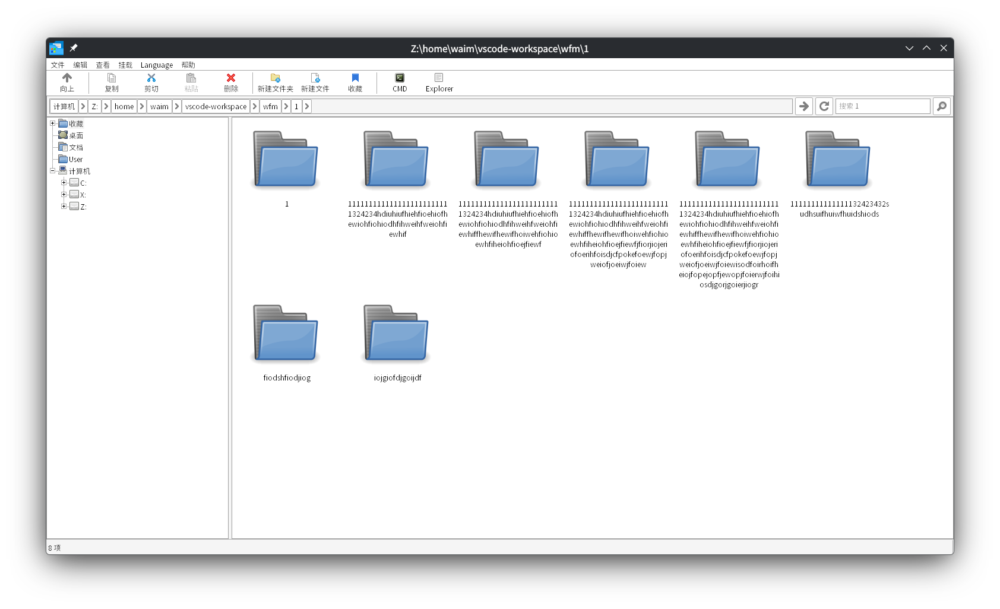

# Winlator File Manager

更快，更方便，支持多语言，强大且简单快速的文件管理器。
运行在Wine / Winlator 上。

通过 AI 完成了百分之99% 的编写工作。

# 截图




# 注册表结构

所有配置都在 `HKEY_CURRENT_USER\Software\Winlator\WFM` 下，不写 HKLM，不需要管理员权限。
用 regedit 手改也可以，改完**重启 WFM 生效**。
删除整个 `HKEY_CURRENT_USER\Software\Winlator\WFM` 即可恢复全部默认设置（也可以直接跑 `del-reg.bat`）。

## 键总览

| 键 | 作用 |
| --- | --- |
| `WFM` | 视图、排序等全局开关，全是 DWORD 值（见下表） |
| `WFM\Bookmarks` | 收藏路径列表 |
| `WFM\AutoOpenBookmark` | 启动时自动打开的收藏 |
| `WFM\Language` | 界面语言 |
| `WFM\FileAssociations\<扩展名>` | 某种扩展名用哪个程序打开 |
| `WFM\ContextMenu\<组名>\<条目名>` | 自定义右键菜单命令 |
| `WFM\CurrentISOPath` | 当前已挂载的镜像路径 |

## `WFM` 主键下的 DWORD 值

| 值名 | 取值 | 作用 | 默认 |
| --- | --- | --- | --- |
| `ViewStyle` | `0` 大图标 / `1` 小图标 / `2` 列表 / `3` 详细信息 | 内容区使用哪种视图样式 | `3` |
| `ShowHidden` | `0` / `1` | 是否显示隐藏文件 | `0` |
| `FolderSortMode` | `0` 经典（分组随升降序一起翻转）/ `1` 文件夹恒置顶 / `2` 文件夹恒沉底 / `3` 不区分（文件夹与文件混排） | 文件夹在列表里的位置策略 | `0` |
| `ShowDriveBarMode` | `0` 图形占用条 +「空闲/总量」文字 / `1` 只显示总容量 / `2`「大小」列留空 | 详细信息视图里驱动器在「大小」列的显示方式 | `0` |
| `IconViewIconSize` | `32` / `48` / `64` / `96` / `128` | 大图标视图的图标边长（像素） | `32` |
| `IconViewLabelLines` | `0` 按图标宽度自动换行 / `1`–`5` 固定行数 | 大图标视图里文件名最多显示几行 | `0` |
| `ShowDriveBar` | `0` / `1` | **遗留值**：只在 `ShowDriveBarMode` 不存在时读一次，用于从旧版升级迁移（`1` → 图形条，`0` → 留空）。当前版本不再写入 | — |

取值越界或类型不对时会被直接忽略、回落到默认值，不会导致异常。

## 各子键说明

### `WFM\Bookmarks` — 收藏列表

- 值名固定为 `Bookmark0`、`Bookmark1`……（REG_SZ），值是该收藏的完整路径，最多 50 条。
- 保存时整个子键先清空重建，所以序号始终从 0 开始连续排列。

### `WFM\AutoOpenBookmark` — 启动时自动打开

- 唯一的 `Path`（REG_SZ）＝ 要自动打开的收藏路径。
- 路径已不存在时直接跳过，正常显示默认目录。

### `WFM\Language` — 界面语言

- 唯一的 `lang`（REG_SZ）：`zh` / `en` / `pt` / `ru`。
- 在菜单栏 `language` 里切换后写到这里，**重启 WFM 才生效**，且不受系统 locale 与编码影响。

### `WFM\FileAssociations\<扩展名>` — 文件关联

- 值 `Program`（REG_SZ）＝ 打开该扩展名的程序完整路径，例如 `C:\windows\notepad.exe`。
- 扩展名子键带点前缀，如 `.md`、`.aaa`。
- **只影响 WFM 自身**，不会修改系统的全局文件类型关联。

### `WFM\ContextMenu\<组名>\<条目名>` — 自定义右键菜单

- 一级子键名 = 右键菜单里的**组名**（显示为带子菜单的一项），其下的值名 = 该组里的**条目名**。
- 值的类型是 REG_SZ，内容 = 点击该条目时要执行的命令行。
- 命令行里可用三个占位符：
  - `%FILE%` — 完整文件路径
  - `%BASENAME%` — 不含扩展名的文件名
  - `%DIR%` — 文件所在目录
- 替换时若值里含空格等特殊字符会自动加引号；如果模板里已经写成 `"%FILE%"`，就按原样替换、不再套一层引号。
- 限制：最多 10 个组、每组最多 10 个条目；只在**单选一个文件**时出现（文件夹不显示）。
- 文件名里含 `"` 或 `%` 时无法安全替换，该条目会保留但点击时提示原因，**不会执行被篡改的命令**。

### `WFM\CurrentISOPath` — 当前挂载的镜像

- 用该键的**默认值**（无名值，REG_SZ）保存镜像文件路径。
- 挂载镜像时写入，取消挂载时整个子键删除。

## 完整示例

下面是各项取默认值时的完整结构，可直接另存为 `.reg` 导入（其中的路径请按自己的实际情况修改）：

```
Windows Registry Editor Version 5.00

[HKEY_CURRENT_USER\Software\Winlator\WFM]
"ViewStyle"=dword:00000003
"ShowHidden"=dword:00000000
"FolderSortMode"=dword:00000000
"ShowDriveBarMode"=dword:00000000
"IconViewIconSize"=dword:00000020
"IconViewLabelLines"=dword:00000000

[HKEY_CURRENT_USER\Software\Winlator\WFM\Bookmarks]
"Bookmark0"="Z:\\bin"
"Bookmark1"="Z:\\home\\waim\\Game"

[HKEY_CURRENT_USER\Software\Winlator\WFM\AutoOpenBookmark]
"Path"="Z:\\bin"

[HKEY_CURRENT_USER\Software\Winlator\WFM\Language]
"lang"="zh"

[HKEY_CURRENT_USER\Software\Winlator\WFM\FileAssociations\.aaa]
"Program"="C:\\windows\\notepad.exe"

[HKEY_CURRENT_USER\Software\Winlator\WFM\FileAssociations\.md]
"Program"="C:\\windows\\notepad.exe"

[HKEY_CURRENT_USER\Software\Winlator\WFM\ContextMenu\常用操作]
"用记事本打开"="C:\\windows\\notepad.exe %FILE%"
"打开所在目录"="explorer %DIR%"

[HKEY_CURRENT_USER\Software\Winlator\WFM\CurrentISOPath]
@="Z:\\Game\\disc.iso"
```

# 实现的功能（排名不分前后）

1. 右键exe的菜单功能里可以查看更清晰的文件图标
2. 可以收藏路径
3. 可以设置其中一个收藏的路径在启动wfm 立即打开
4. 工具栏实现直接定位到挂载的镜像文件
5. 工具栏实现直接取消挂载的镜像
6. 左侧栏加入了User，可以直接定位到C盘用户目录
7. 高DPI适配，且字体在wine下运行也不会模糊
8. exe图标可以直接获取到软件的图标集合，查看不同尺寸的图标，并且可以保存为ico文件
9. 加入了语言切换功能，设置后不受locale影响
10. 可以查看盘符剩余空间大小
11. 查看视图（大图标，小图标）持久保存在注册表
12. 搜索结果右键指定文件的菜单里可以直接定位到文件所在位置
13. 加入了explorer启动，cmd启动的按钮
14. 使用挂载功能不再需要*libcdio.dll*文件了-> by [nostalgia296](https://github.com/Waim908/wfm/pull/2)
15. 可以查看隐藏文件了
16. 可以设置或选择文件类型的打开程序（不干预系统全局文件类型设置）
17. 文件排序可以在查看中切换为windows资源管理器的同款文件夹在上的排序，如果你习惯dolpin或者explorer的排序可以快速上手
18. 长路径在代码上限内可以有效支持，如果太长可以在地址栏...菜单选择路径跳转
19. 大图标视图可以自定义图标大小了（查看 → 大图标视图 → 图标大小），以及显示文件名的行数（查看 → 大图标视图 → 文件名行数），设置为无限后可以显示超长的文件名，类似linux上的dolpin和thunar；这两项只对大图标视图生效，其他视图下该菜单项置灰
20. 跨窗口文件复制
21. 可以显示lnk文件图标了
22. 文件夹可以显示日期和项目数量了

相较于原版wfm

1. 加入了中文支持
2. 文件列出速度更快
3. wfm 启动速度更快
4. 修复了一些bug
5. 除了中文也包含了 葡萄牙语 英语 俄语 的更新与支持。
6. 搜索文件速度更快，且更稳定
7. 彻底重构了底层列出文件的逻辑，性能大幅提升

# 问题

Q: 没有显示`.XXX`的Linux隐藏文件？

A: 

Q: 装了或卸了软件之后，某种文件类型的图标没跟着变？

A: 点 `查看 -> 清除图标缓存`。图标是按扩展名缓存的（仅当次会话），运行期间改了文件关联不会自动失效。

Q: 换了同一个路径上的 `.exe` 之后，图标还是旧的？

A: 只能重启 WFM。Wine 的 shell 图标缓存按「图标源文件 + 资源索引」记录，其中**不含修改时间**，
   WFM 清不到这一层，所以点「清除图标缓存」也刷不出新图标。

Q： 禁用libcdio 挂载功能？

A：在编译时加上 ```make USE_LIBCDIO=0``` 

Q: 需要创建X挂载盘？

A: 

方法1

打开winecfg

切换到驱动器(driver) , 点击添加

选择盘符X

驱动器类型设置为光驱（如果你只是单纯解压镜像文件甚至不需要设置为光驱）

注意路径必须设置为非根目录否则会出问题，尤其对于winlator而言

方法2

执行以下命令
```
# 切换到你的WINEPREFIX 目录，如果没有定义那么就在~/.wine

mkdir drive_x

cd dosdevices

ln -s ../drive_x x:

cd ../drive_x

# 伪造X盘序列号(在winlator中) <--  可选，wine默认就是这个序列号
echo "58000000" > .windows-serial
```

无论X盘在winecfg中的定义是光驱还是自动检测都是可以正常解压文件进去的，你也可以手动在winecfg中定义X盘为光驱类型

Q：如何卸载wfm？

A: 确保你的挂载盘取消挂载后，删除*wfm.exe*和*libcdio.dll*，执行bat脚本*del-reg.bat*或者删除注册表
```HKEY_CURRENT_USER\Software\Winlator\WFM```
更进一步请删除
```HKEY_CURRENT_USER\Software\Winlator```


# 在 Linux 上快速完成编译

1. 安装mingw64

2. ```make -j4``` 如果需要 libcdio 文件挂载功能支持，必须使用```make USE_LIBCDIO=1 -j4``` PS: 数字4 为编译线程数，根据CPU核心数自行设置。

3. 编译完成，执行exe文件

# 感谢以下项目

- [libcdio](https://github.com/libcdio/libcdio)

- [wine](https://github.com/wine-mirror/wine)